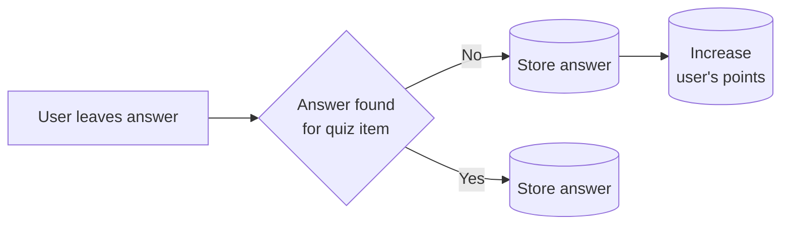

# Serverless backend

- Serverless (AWS)
  - DynamoDB
  - API Gateway
  - Lambdas
  - S3 (TBA)
- Typescript
- Node 14.x
- Docker (development)

## Start development

Run `Docker compose up` for running local DynamoDB (admin console in localhost:8001)

Run `create-local-dynamodb.ps1` to create needed tables

Run `serverless offline` to spin up rest of the environment

### About project structure

**Controllers** export functions for lambda to handle http request from API Gateway. Add new functions to serverless.yml after exported.

**Services** handle data access.

## Deploy

TBA how to deploy to AWS.

## Database

DynamoDB as database.

Single table design.

| Entity    | Partition key    | Sort key       | GSI-PK1          |
| --------- | ---------------- | -------------- | ---------------- |
| User      | USER#\<uuid>     | USER#\<uuid>   |
| Quiz Item | QUIZITEM#\<uuid> | <timestamp>    |
| Answer    | USER#\<uuid>     | ANSWER#\<uuid> | QUIZITEM#\<uuid> |

See for help: https://www.youtube.com/watch?v=DIQVJqiSUkE&t=1750s

## Use cases

## Examples

- https://github.com/serverless/examples/blob/v3/aws-node-typescript-rest-api-with-dynamodb/todos/create.ts
- https://github.com/serverless-is/hello-world-typescript
- https://www.youtube.com/watch?v=KYy8X8t4MB8&t=1270s
